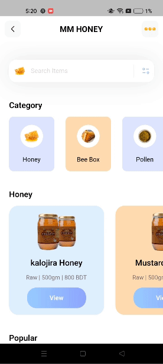

# Flutter Honey Shop UI

ListView in Flutter - Efficient and Fancy Scrolling Experience. Learn one of the scariest topics in Flutter - what is ListView and how to make use of it to make an elegant list view.

Whats you can learn from this Repo - 
- Custom appBar and how to customize default Appbar.
- Custom search bar and customize default Textfield.
- Learn about ListView and create model for data
- ListView horizontal and vertical scrolling effect
- ListView.Separeted

## Preview

   <table>
      <tr>
         <td style="text-align: center">
            
         </td>
         <td style="text-align: center">
            
         </td>
      </tr>
   </table>

